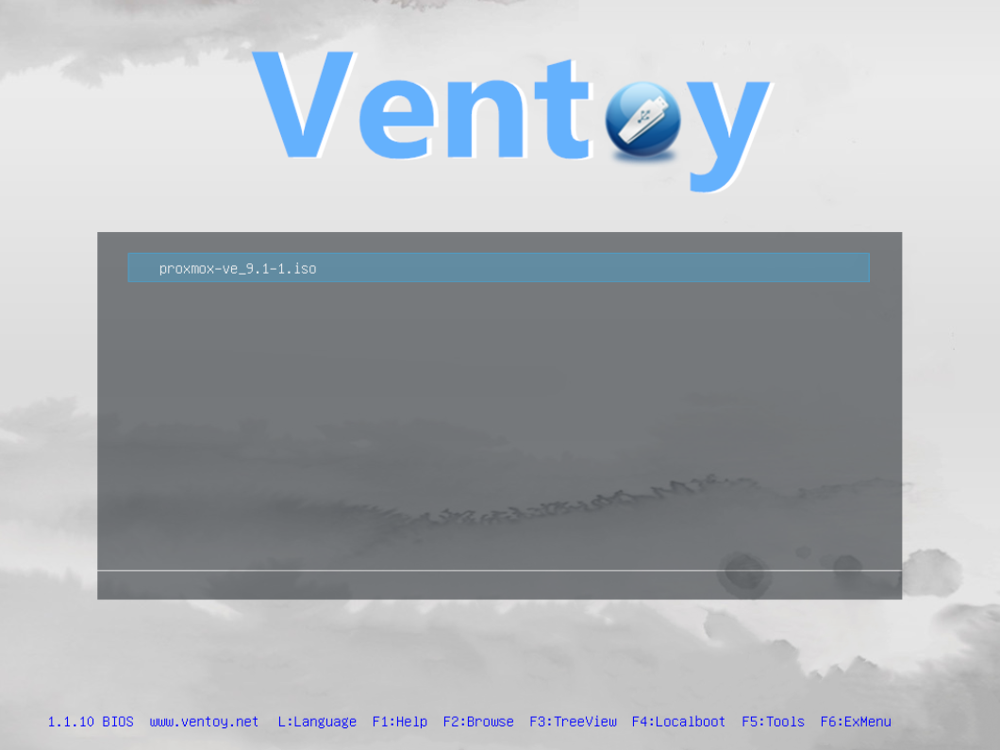
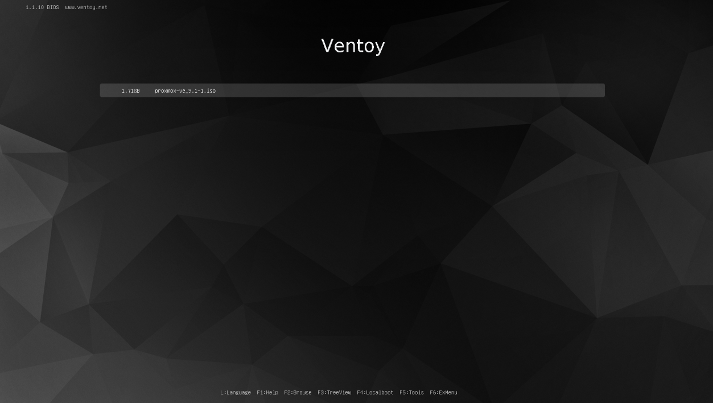

Я довольно давно работаю с загрузочными носителями. В те времена одним из самых популярных решений был [2k10](https://usbtor.ru/viewtopic.php?t=1580) где-то до сих пор хранится флешка с ним. Да и простой `dd` обычно выручает, когда нужно быстро установить систему или выполнить восстановление.

Пару лет назад услышал про [Ventory](https://www.ventoy.net) и решил попробовать. Решение мне сразу понравилось. Раньше я сам пытался собрать нечто подобное на базе GRUB и костылей для корректной работы WinPE. Даже присматривался к аппаратному решению `Zalman ZM`. Но со временем потребность отпала - пока не появился Ventoy, который делает всё «из коробки».

## Почему Ventoy?
- Поддержка различных образов (ISO, WIM, IMG, VHD(x), EFI)
- Не нужно перезаписывать флешку при добавлении нового образа - просто копируешь файл в корень
- Сохранение всех данных на носителе при обновлении
- Встроенная поддержка persistence для некоторых дистрибутивов
- Гибкая темизация интерфейса и плагины для расширения функционала
- Работает с разделами exFAT, NTFS, ext4 — можно хранить образы и обычные файлы вместе

## Установка
На момент написания статьи актуальная версия `1.1.10`. Установка выполняется на носитель `/dev/sdb`

Скачиваем архив с официального сайта https://www.ventoy.net/en/download.html (страница загрузки ведёт на sourceforge.net)

```bash
$ tar -xvzf ventoy-1.1.10-linux.tar.gz
$ cd ventoy-1.1.10
```

Запускаем установку:
```bash
$ sudo ./Ventoy2Disk.sh -i /dev/sdb

**********************************************
      Ventoy: 1.1.10  x86_64
      longpanda admin@ventoy.net
      https://www.ventoy.net
**********************************************

Disk : /dev/sdb
Size : 3 GiB
Style: MBR


Attention:
You will install Ventoy to /dev/sdb.
All the data on the disk /dev/sdb will be lost!!!

Continue? (y/n) y

All the data on the disk /dev/sdb will be lost!!!
Double-check. Continue? (y/n) y

Create partitions on /dev/sdb by parted in MBR style ...
Done
Wait for partitions ...
partition exist OK
create efi fat fs /dev/sdb2 ...
mkfs.fat 4.2 (2021-01-31)
success
Wait for partitions $vPART1 and $vPART2 ...
/dev/sdb1 exist OK
/dev/sdb2 exist OK
partition exist OK
Format partition 1 /dev/sdb1 ...
mkexfatfs 1.3.0
Creating... done.
Flushing... done.
File system created successfully.
mkexfatfs success
writing data to disk ...
sync data ...
esp partition processing ...

Install Ventoy to /dev/sdb successfully finished.
```

После установки носитель монтируется как обычный диск с меткой `Ventoy`. Теперь достаточно скопировать ISO-образы в корень - они автоматически появятся в загрузочном меню.

```bash
$ tree /run/media/solo/Ventoy/
/run/media/solo/Ventoy/
└── proxmox-ve_9.1-1.iso

1 directory, 1 file
```



## Обновление без потери данных

Одно из главных преимуществ - обновление без переформатирования.

Достаточно запустить:
```bash
$ sudo ./Ventoy2Disk.sh -u /dev/sdb
```
Все образы и файлы на флешке останутся нетронутыми.

## Кастомизация: тёмная тема

В поисках более сдержанного оформления наткнулся на [night ventoy theme](https://www.gnome-look.org/p/1757215). Немного доработал под себя и выложил на GitHub: [ventoy-night-theme](https://github.com/DesSolo/ventoy-night-theme)



## Заключение
Ventoy стал для меня полезным инструментом. Больше не нужно держать несколько флешек с разными утилитами- одна с Ventoy заменяет все.
